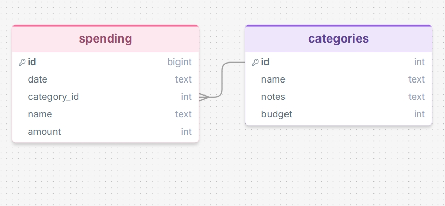
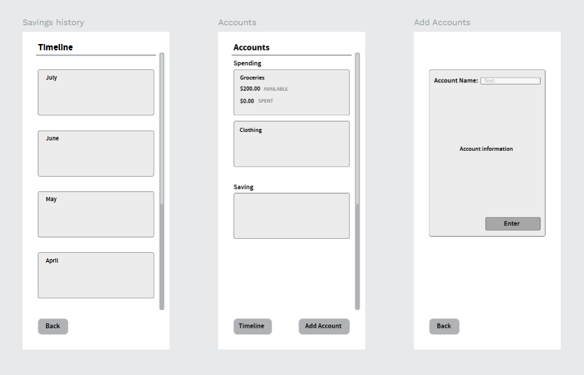

# Sprint 1 - Developing a DB and UI Prototype

## Sprint Goals

Develop a design for the database and a UI prototype that simulates the key functionality of the system. Test and refine the UI so that it can serve as the model for the next phase of development in Sprint 2.

### Specific Goals

**Edit these goals as needed**

- Design the database:
    - Tables
    - Fields / types
    - Primary keys
    - Default / nullable values
    - Relationships (foreign keys)
- Design the UI
    - Key pages
    - User interactions and 'flow'
    - Page layouts / features
    - Ask user for initial details or change
    - Colour palette
    - Etc.

--text: #13140e;
--background: #fafbf9;
--primary: #95a073;
--secondary: #a7c3ae;
--accent: #88aea1;

## Initial Database Design

Spending table with date, category id, name, and amount.
Categories table with name, notes, and budget.

### Required Data Input

The data will be obtained by the user inputting the amount of money they want to spend between the different accounts. The user will be able to click on a button where it takes them to a page where they can type in the amount of money they want ot put into the seperate accounts

Replace this text with a description of what data will be input, and where / how it will be obtained.

### Required Data Output

integers will be displayed when the user puts in money into the acounts or spends money. The system will reveal the saved money at the end of the month.

Replace this text with a description of the outputs for the system - what types of data will be displayed?

### Required Data Processing

The system will calculate the money that has been used and the money that hasn't been used throughout the month and give a final outpout at the end of the four weeks

Replace this text with a description of how the data will be processed to achieve the desired output(s) - any processes / formula?

## UI 'Flow'

The first stage of prototyping was to explore how the UI might 'flow' between states, based on the required functionality.

This Figma demo shows the initial design for the UI 'flow':

you can access the flow [here](https://design.penpot.app/#/view?file-id=81f57451-85cc-819d-8008-7fdbba0b2af0&page-id=81f57451-85cc-819d-8008-7fdbba0b2af1&section=interactions&frame-id=ec83d70e-a449-809c-8008-7fdbbeeb6762&index=0&share-id=3be9e5e1-190f-8090-8008-7ff767141af9)

### Testing

I had a chat with my end user.
Replace this text with notes about what you did to test the UI flow and the outcome of the testing.

### Changes / Improvements

My end user suggested to add an information button to help them know what is happening on each page of the website.
Replace this text with notes any improvements you made as a result of the testing.

*IMPROVED FIGMA FLOW - PLACE THE FIGMA EMBED CODE HERE - MAKE SURE IT IS SET SO THAT EVERYONE CAN ACCESS IT*

## Initial UI Prototype

The next stage of prototyping was to develop the layout for each screen of the UI.

This Figma demo shows the initial layout design for the UI:

*FIGMA PROTOTYPE - PLACE THE FIGMA EMBED CODE HERE - MAKE SURE IT IS SET SO THAT EVERYONE CAN ACCESS IT*

### Testing

Replace this text with notes about what you did to test the UI flow and the outcome of the testing.

### Changes / Improvements

Replace this text with notes any improvements you made as a result of the testing.

*FIGMA IMPROVED PROTOTYPE - PLACE THE FIGMA EMBED CODE HERE - MAKE SURE IT IS SET SO THAT EVERYONE CAN ACCESS IT*

## Refined UI Prototype

Having established the layout of the UI screens, the prototype was refined visually, in terms of colour, fonts, etc.

This Figma demo shows the UI with refinements applied:

*FIGMA REFINED PROTOTYPE - PLACE THE FIGMA EMBED CODE HERE - MAKE SURE IT IS SET SO THAT EVERYONE CAN ACCESS IT*

### Testing

Replace this text with notes about what you did to test the UI flow and the outcome of the testing.

### Changes / Improvements

Replace this text with notes any improvements you made as a result of the testing.

*FIGMA IMPROVED REFINED PROTOTYPE - PLACE THE FIGMA EMBED CODE HERE - MAKE SURE IT IS SET SO THAT EVERYONE CAN ACCESS IT*

## Sprint Review

Replace this text with a statement about how the sprint has moved the project forward - key success point, any things that didn't go so well, etc.

